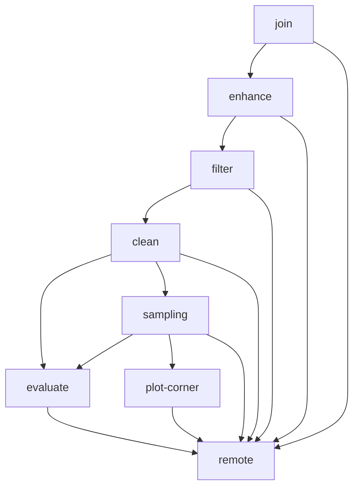

```mermaid
flowchart TD
	node1["clean"]
	node2["enhance"]
	node3["evaluate"]
	node4["filter"]
	node5["join"]
	node6["plot-corner"]
	node7["sampling"]
	node8["remote"]
	node1-->node3
	node1-->node7
	node1-->node8
	node2-->node4
	node2-->node8
	node3-->node8
	node4-->node1
	node4-->node8
	node5-->node2
	node5-->node8
	node6-->node8
	node7-->node3
	node7-->node6
	node7-->node8
```
